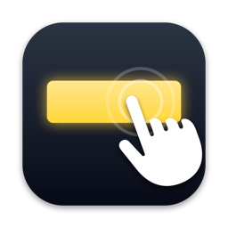

<p align="center"></p>
<h1 align="center">Xeneon Touch</h1>

<p align="center">
  <b>Make the Corsair XENEON EDGE touchscreen actually work on macOS.</b><br>
  A tiny menu-bar app. No kernel extension. No iCUE.
</p>

<p align="center">
  
  
  
  
</p>

---

## The problem

Plug a Corsair **XENEON EDGE** (14.5" 2560×720 touch bar) into a Mac and the picture works, but touch is
useless: macOS has no touchscreen support, so the panel is treated as a mouse whose coordinates are mapped
onto your **main** display. Touch the Edge, and the pointer jumps around on your other monitor.

## The fix

**Xeneon Touch** is a menu-bar app wrapping a tiny user-space driver that:

- **seizes** the Edge's HID device, so macOS stops treating it as a mouse
- maps every touch onto the **Xeneon display itself**, wherever it sits in your arrangement
- injects real press / drag / release events at that spot
- **puts the cursor back** where it was after you lift your finger, so your mouse stays on your main screen

```
 finger down ──▶ mouseMoved + mouseDown   (hover first, so overlay scroll bars appear)
 finger move ──▶ mouseDragged
 finger up   ──▶ mouseUp, cursor restored
```

Works with any display arrangement (left, right, above, below, scaled resolutions) — geometry is read
live from CoreGraphics on every event, nothing to configure.

## Install — the app (recommended)

1. Download **`Xeneon Touch-vX.Y.Z.dmg`** from the
   [latest release](https://github.com/MorganZ/xeneon-edge-touch-macos/releases/latest).
2. Drag **Xeneon Touch** to **Applications** and open it.
   macOS will say *"Xeneon Touch" Not Opened* because the build isn't notarized. Click **Done**
   (not *Move to Trash*), then **System Settings → Privacy & Security → Open Anyway**.
   Or from a terminal: `xattr -dr com.apple.quarantine "/Applications/Xeneon Touch.app"`.
3. Grant the two permissions it asks for:

   | Permission | Why |
   |---|---|
   | **Input Monitoring** | to take exclusive control of the touch HID device |
   | **Accessibility** | to post mouse events |

That's it. It lives in the menu bar (🖐), starts at login, and the status line tells you when the
Edge is connected. **To uninstall, drag the app to the Trash** — there is nothing else on disk.

Menu options: *Restore cursor after touch*, *Start at login*, *Open Privacy & Security…*, *Quit*.

## Build from source

```sh
git clone https://github.com/MorganZ/xeneon-edge-touch-macos.git
cd xeneon-edge-touch-macos
make app      # -> dist/Xeneon Touch.app
make dmg      # -> dist/Xeneon Touch-<version>.dmg
```

Needs only the Xcode Command Line Tools (`xcode-select --install`).

Debugging? `make touchd && ./touchd -v` runs the bare driver in a terminal and prints every touch
(grant the two permissions to your terminal app for that).

## Tips

- Scroll bars are hard to grab by touch when they're hidden. **System Settings → Appearance →
  Show scroll bars → Always** makes them permanent.
- For bigger text on the Edge, pick the **1920×540** scaled mode in Displays.

## How it works (the short version)

The Edge's touch controller (`wch.cn`, VID `0x27c0` / PID `0x0859`) exposes three USB HID interfaces:
a multitouch digitizer, a *mouse* with absolute coordinates, and a vendor interface used by iCUE.
Out of the box the firmware only ever reports through the **mouse** interface, as a single contact:

```
report 7 : [07] [buttons] [X u16 0‥16383] [Y u16 0‥9599] [wheel]
```

The driver opens the device with `kIOHIDOptionsTypeSeizeDevice`, reads those raw reports, normalises X/Y,
finds the Xeneon display by its EDID vendor ID (`0x0E58`, Corsair), and posts `CGEvent`s inside
`CGDisplayBounds` of that display. That is the entire driver — `Driver.swift`, ~170 lines.
The app (`App/XeneonTouchApp.swift`) is a ~100-line AppKit status item around it that registers itself
as a login item with `SMAppService`, so deleting the app removes everything.

## Limitations

- **Single touch only.** The digitizer interface stays silent unless something (iCUE, via the vendor
  interface) switches the firmware into multitouch mode; that protocol is undocumented. So no two-finger
  scroll or pinch — yet. If you know the vendor command, open an issue!
- No iCUE widgets, dashboards or sensors: this is a display + touch driver, nothing more.
- Builds are ad-hoc signed, not notarized (notarization needs a paid Apple Developer ID). Gatekeeper
  blocks the first launch once; see Install step 2.
- Only tested on Apple Silicon (Mac Studio M1 Max, macOS 26). Universal binary, so Intel should work too.

## Related projects

- [ymlaine/TouchscreenDriver](https://github.com/ymlaine/TouchscreenDriver) — earlier Edge driver, click-only
- [shueber/Touch-Up](https://github.com/shueber/Touch-Up) — universal multitouch driver with a GUI
- [Touch-Base UPDD](https://www.touch-base.com) — commercial

## License

MIT
